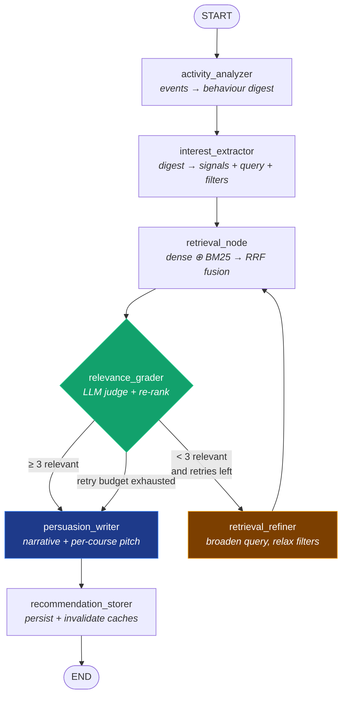

<div align="center">

# ◈ SmartReco

**A behavioural AI recommendation agent that watches, understands, and persuades.**

Built for the **SmartReco Build Challenge 2026**

[](https://github.com/ayalpha/smartreco-build-challenge-2026/actions/workflows/smartreco-checks.yml)


</div>

---

## 1. What this is, and what makes it different

SmartReco is a learning marketplace (think Udemy) with a genuine **agent** behind the
recommendations rather than a similarity query wearing a trench coat.

It observes real behaviour — clicks, searches, dwell time, cart adds — and then runs a
**seven-node LangGraph state machine** that reads that behaviour, extracts the interests
behind it, retrieves candidates with hybrid vector search, grades every candidate,
**loops back to broaden the search when the results are thin**, and only then writes a
persuasive recommendation that cites the evidence it was based on.

Five things here are unusual for a hackathon build:

| | |
|---|---|
| **It argues, it doesn't just rank.** | The `persuasion_writer` node is given the behavioural evidence and *instructed to reference it*, then forbidden from inventing prices, urgency or courses. The output reads like it was observed, because it was. |
| **The reasoning is user-visible.** | "Why this recommendation?" expands to the actual interest signals, their confidence scores, and the evidence sentence behind each one. Nothing is hidden behind a black box. |
| **It never returns a 500.** | Every node catches its own exceptions and falls back to a deterministic heuristic. Mesh unreachable? Templated copy. Qdrant down? Embedded in-process index. Redis down? Process-local cache with identical semantics. Runs are flagged `degraded`, not lost — **which is why the full graph is exercised end to end in CI with no API keys at all**. |
| **Retrieval is genuinely hybrid.** | Dense Mesh embeddings in Qdrant **⊕** Okapi BM25 over the SQL catalog, fused with Reciprocal Rank Fusion, metadata-filtered by inferred skill level and price band, then re-ranked by an LLM judge. Every stage is implemented, not gestured at. |
| **Dual-write drift is observable and repairable.** | The admin dashboard compares SQL and Qdrant counts live, and a one-click idempotent re-index heals any gap. |

> ### ★ Mesh API is the only AI path
> Every LLM completion and every embedding routes through the Mesh gateway at
> `https://api.meshapi.ai/v1`, via a single module: [`app/agent/mesh_client.py`](app/agent/mesh_client.py).
> There is **no direct Anthropic, OpenAI or Gemini SDK call anywhere in this repository**.
> The `openai` package is used strictly as an OpenAI-*compatible* HTTP transport with
> `base_url` pointed at Mesh — Mesh's own documented integration pattern. Verify it yourself:
> ```bash
> grep -rn "OpenAI(" app/          # one hit: mesh_client.py, base_url=MESH_BASE_URL
> grep -rn "anthropic\|google.generativeai" app/ --include=*.py   # no SDK imports
> ```

---

## 2. Architecture

```
                                  BROWSER
   ┌───────────────────────────────────────────────────────────────────────────┐
   │  Jinja2 + Tailwind          tracker.js                recommendations.js  │
   │  server-rendered pages      batches events q 5s       polls /latest q 60s │
   │                             sendBeacon on unload      skeleton ⇄ panel    │
   └────────────┬──────────────────────┬───────────────────────────┬───────────┘
                │ page loads           │ POST /api/events          │ GET /api/…/latest
                ▼                      ▼  (returns in ms)          ▼
   ┌───────────────────────────────────────────────────────────────────────────┐
   │                            FastAPI application                            │
   │   routers/  auth · products · events · recommendations · admin            │
   │   JWT in HttpOnly cookie (pages) or Bearer header (API) · flash messages  │
   └──────┬─────────────────┬────────────────────┬──────────────────┬──────────┘
          │ dual-write      │ trigger policy     │ cache + locks    │ schedule
          ▼                 ▼                    ▼                  ▼
   ┌────────────┐   ┌───────────────┐   ┌──────────────┐   ┌─────────────────┐
   │ PostgreSQL │   │  APScheduler  │   │    Redis     │   │  APScheduler    │
   │  (system   │   │  background   │   │ SET NX EX    │   │  daily 18:00    │
   │  of record)│   │  agent queue  │   │ locks+cache  │   │  email digest   │
   └─────┬──────┘   └───────┬───────┘   └──────────────┘   └────────┬────────┘
         │ mirror           │ invoke                                │ deliver
         ▼                  ▼                                       ▼
   ┌────────────┐   ┌────────────────────────────────────┐   ┌─────────────┐
   │   Qdrant   │◀──│    LangGraph recommendation graph  │   │  SendGrid / │
   │  vectors + │   │        (7 nodes, 1 conditional)    │   │  SMTP /     │
   │  payload   │──▶│                                    │   │  Telegram   │
   └────────────┘   └──────────────┬─────────────────────┘   └─────────────┘
                                   │ every LLM + embedding call
                                   ▼
                    ┌──────────────────────────────┐        ┌──────────────┐
                    │   ★ MESH API GATEWAY ★       │───────▶│  LangSmith   │
                    │   api.meshapi.ai/v1          │ traces │  observ.     │
                    │   claude · gpt-4o · embed    │        └──────────────┘
                    └──────────────────────────────┘
```

### The recommendation graph



The live topology is always available from the running app at
**`GET /api/agent/graph`** (ASCII + Mermaid, rendered from the compiled graph) and as a
human-readable page at **`/architecture`**.

---

## 3. Tech stack

| Layer | Choice | Why this one |
|---|---|---|
| **Backend** | FastAPI (Python 3.11+) | Async, real type hints, Pydantic contracts and free OpenAPI docs |
| **LLM + embeddings** | **Mesh API** (mandatory) via `openai` SDK with `base_url` override | One gateway for every model call: single place for retries, timeouts, token accounting and degradation |
| **Agent framework** | LangGraph + LangChain core | Typed state, explicit conditional edges, `MemorySaver` checkpointing for replayable runs |
| **Database** | PostgreSQL 16 + SQLAlchemy 2.0 ORM + Alembic | System of record; SQLite fallback for zero-setup local dev |
| **Vector DB** | Qdrant (`qdrant-client`) | Cosine ANN + payload filtering; embedded in-process fallback when no server is reachable |
| **Keyword search** | Okapi BM25, implemented in `app/vector_store/bm25.py` | The sparse half of hybrid retrieval, with zero extra infrastructure |
| **Observability** | LangSmith | Full graph tracing with `user_id` / `trigger_reason` / `event_count` metadata |
| **Scheduler** | APScheduler | Daily digest cron *and* the background queue for event-triggered runs |
| **Cache / locks** | Redis (`redis-py`) | `SET NX EX` per-user locks + result cache; in-memory fallback |
| **Email** | SendGrid *or* SMTP *or* console | `console` is the default so digests work with no credentials |
| **Frontend** | Jinja2 + vanilla JS + Tailwind CDN | No build step; the tracker is ~350 lines of dependency-free JS |
| **Auth** | JWT (`python-jose`) + bcrypt | HttpOnly cookie for pages, Bearer token for API — one token type |
| **Tests** | pytest — **135 tests, all passing** | Runs the real graph with no services and no keys |

---

## 4. Feature checklist

### Required

- [x] **Email/password auth** with JWT — HttpOnly cookie for pages, `Authorization: Bearer` for the API
- [x] **Two roles** — `user` (browse + recommendations) and `admin` (catalog CRUD); the first account registered is auto-promoted to admin
- [x] **Clean login / register / logout** flows with signed, single-use **flash messages**
- [x] **Profile page** showing recommendation history, recent raw events and live trigger diagnostics
- [x] **Product catalog** with search, category / level / price filters and pagination
- [x] **Admin CRUD** — create, edit, delete (all fields: title, description, category, tags, price, skill_level, duration, thumbnail_url, created_at)
- [x] **DUAL-WRITE on every mutation** — SQL *and* Qdrant, including **delete removes from both**
- [x] **Deactivation removes the vector** too, so an inactive course can never be recommended
- [x] **Seed script with 38 realistic courses** across all ten required categories — fully idempotent
- [x] **Behavioural tracking** of all six events: `page_view`, `product_click`, `search_query`, `time_spent`, `add_to_cart`, `recommendation_click`
- [x] **Batched, non-blocking tracker** — 5-second flush, `sendBeacon` on unload, re-queue on failure
- [x] **`POST /api/events`** accepts batch arrays and returns in milliseconds; the agent is *never* run inline
- [x] **Event schema** `(id, user_id, session_id, event_type, product_id, metadata JSON, timestamp)` with a composite index on `(user_id, timestamp)`
- [x] **7-node LangGraph agent** with the exact node names from the brief
- [x] **Smart triggering** — every 10th new event, first-time users, or stale (>2h) with 5+ new events
- [x] **Background task queue** (APScheduler) — never synchronous
- [x] **Duplicate-run guard** — Redis `SET NX EX` lock keyed by user id
- [x] **"For You" homepage section** with narrative card, product cards and CTAs
- [x] **60-second polling** auto-refresh (accelerating to 6s while a run is in flight)
- [x] **"Why this recommendation?"** expandable panel with interest signals + confidence bars
- [x] **Loading skeleton states** while the agent is generating

### Bonus — all four, complete

- [x] **BONUS 1 — LangGraph agent framework**: typed `TypedDict` state, named nodes, a real conditional edge with three outcomes, a refinement loop back into retrieval, and a `MemorySaver` checkpointer for replayable debugging
- [x] **BONUS 2 — Scheduled proactive email delivery**: APScheduler cron at a configurable hour (default 18:00), targets users with 5+ events today, runs the agent, sends a hand-built table-layout HTML email with product cards, audits every attempt in `email_digests` — **plus Telegram delivery** when `TELEGRAM_BOT_TOKEN` is set
- [x] **BONUS 3 — LangSmith observability**: full graph tracing to project `smartreco-agent` with custom `user_id` / `trigger_reason` / `event_count` / model metadata and filterable tags — **selectively scoped** so health checks and the event hot path are never traced
- [x] **BONUS 4 — Retrieval polish**: LLM-as-judge **re-ranking** blended 65/35 with retrieval rank · **metadata filtering** on inferred skill level and price band · **hybrid dense + BM25 search fused with Reciprocal Rank Fusion** · **embedding model name + version stamped into every Qdrant payload** for auditability

---

## 5. Setup

### Option A — Docker Compose (one command)

```bash
git clone https://github.com/ayalpha/smartreco-build-challenge-2026.git
cd smartreco-build-challenge-2026
cp .env.example .env          # then add your MESH_API_KEY
docker compose up -d
```

That brings up PostgreSQL, Qdrant and Redis, runs migrations, seeds 38 courses with demo
users and synthetic behaviour, and serves the app. Open **http://localhost:8000**.

### Option B — Local Python, containerised infrastructure

```bash
python -m venv .venv && source .venv/bin/activate    # Windows: .venv\Scripts\activate
pip install -r requirements.txt

cp .env.example .env                                  # add MESH_API_KEY
docker compose up -d postgres qdrant redis            # infrastructure only

alembic upgrade head                                  # create the schema
python -m scripts.seed_products --demo-users --with-events --run-agent

uvicorn app.main:app --reload
```

### Option C — Zero infrastructure (no Docker at all)

Set `DATABASE_URL=sqlite:///./smartreco.db` and leave `REDIS_URL` empty in `.env`.
Qdrant falls back to an embedded in-process index automatically, and the app re-indexes
the catalog into it at start-up. Everything works — including the full agent.

```bash
pip install -r requirements.txt
python -m scripts.seed_products --demo-users --with-events
uvicorn app.main:app --reload
```

### Demo accounts

Created by `--demo-users`, password `smartreco123`:

| Email | Role | What to look at |
|---|---|---|
| `learner@smartreco.ai` | user | The "For You" panel — `--with-events` pre-loads a browsing session weighted toward Agentic AI, so a real recommendation is waiting |
| `admin@smartreco.ai` | admin | `/admin` — dual-write status, Mesh routing, live agent runs |

### Seed script flags

```bash
python -m scripts.seed_products                       # 38 courses, SQL + vectors
python -m scripts.seed_products --demo-users          # + admin & learner accounts
python -m scripts.seed_products --with-events         # + a synthetic browsing session
python -m scripts.seed_products --run-agent           # + generate a recommendation now
python -m scripts.seed_products --reindex             # drop and rebuild the collection
python -m scripts.seed_products --skip-vectors        # SQL only (offline smoke test)
```

### GitHub setup for the hackathon

1. Push to a **public** repo.
2. The CI workflow is already at `.github/workflows/smartreco-checks.yml` (verbatim as supplied).
3. Add two secrets under **Settings → Secrets and variables → Actions**:
   - `MESH_API_KEY` — your Mesh key (starts with `rsk_`)
   - `SUBMISSION_TOKEN` — from your hackathon dashboard

---

## 6. Environment variables

| Variable | Default | Purpose |
|---|---|---|
| **Mesh (mandatory)** | | |
| `MESH_API_KEY` | — | **Required for live AI.** Absent ⇒ the agent runs in degraded heuristic mode |
| `MESH_BASE_URL` | `https://api.meshapi.ai/v1` | Mesh gateway endpoint |
| `MESH_MODEL_REASONING` | `openai/gpt-4o` | Analysis, extraction and refinement nodes |
| `MESH_MODEL_WRITER` | `anthropic/claude-3-5-sonnet` | The persuasion narrative |
| `MESH_MODEL_GRADER` | `openai/gpt-4o-mini` | Fast, cheap relevance grading |
| `MESH_EMBEDDING_MODEL` | `openai/text-embedding-3-small` | Document + query embeddings |
| `MESH_EMBEDDING_DIM` | `1536` | Must match the embedding model; changing it requires `--reindex` |
| `MESH_MAX_RETRIES` / `MESH_TIMEOUT_SECONDS` | `3` / `60` | Retry budget and per-request timeout |
| **Database** | | |
| `DATABASE_URL` | `sqlite:///./smartreco.db` | PostgreSQL DSN, or SQLite for local dev |
| `SQL_ECHO` | `false` | Log every SQL statement |
| **Vector DB** | | |
| `QDRANT_URL` | `http://localhost:6333` | Unreachable ⇒ embedded in-process fallback |
| `QDRANT_API_KEY` | — | For Qdrant Cloud |
| `QDRANT_COLLECTION` | `smartreco_products` | Collection name |
| `VECTOR_SEARCH_TOP_K` | `12` | Candidates retrieved per run |
| **Auth** | | |
| `SECRET_KEY` | dev placeholder | **Change in production.** Signs JWTs and flash cookies |
| `ALGORITHM` / `ACCESS_TOKEN_EXPIRE_MINUTES` | `HS256` / `10080` | JWT algorithm and 7-day lifetime |
| **Agent tuning** | | |
| `AGENT_EVENT_TRIGGER_INTERVAL` | `10` | Run after every Nth new event |
| `AGENT_STALE_HOURS` / `AGENT_STALE_MIN_EVENTS` | `2` / `5` | Staleness rule thresholds |
| `AGENT_MIN_RELEVANT_PRODUCTS` | `3` | Below this, the conditional edge refines the query |
| `AGENT_MAX_RETRIEVAL_RETRIES` | `2` | Refinement loop budget |
| `AGENT_RECENT_EVENT_WINDOW` | `60` | Events fed to `activity_analyzer` |
| `AGENT_FINAL_PRODUCT_COUNT` | `6` | Products per recommendation |
| `AGENT_LOCK_TTL_SECONDS` | `300` | Duplicate-run lock TTL |
| **LangSmith (BONUS 3)** | | |
| `LANGSMITH_TRACING` | `false` | Master switch |
| `LANGSMITH_API_KEY` | — | Required for tracing to actually activate |
| `LANGSMITH_PROJECT` | `smartreco-agent` | Project name |
| **Email digest (BONUS 2)** | | |
| `EMAIL_ENABLED` | `true` | Master switch for delivery |
| `EMAIL_BACKEND` | `console` | `console` \| `sendgrid` \| `smtp` |
| `SENDGRID_API_KEY` | — | For `EMAIL_BACKEND=sendgrid` |
| `SMTP_HOST` / `SMTP_PORT` / `SMTP_USERNAME` / `SMTP_PASSWORD` / `SMTP_USE_TLS` | Gmail defaults | For `EMAIL_BACKEND=smtp` |
| `DIGEST_FROM_EMAIL` / `DIGEST_FROM_NAME` | `noreply@smartreco.ai` | Sender identity |
| `DIGEST_SCHEDULE_HOUR` / `DIGEST_SCHEDULE_MINUTE` | `18` / `0` | Cron time |
| `DIGEST_MIN_EVENTS_TODAY` | `5` | Activity bar for inclusion |
| `DIGEST_PRODUCT_COUNT` | `3` | Courses featured in the email |
| `TELEGRAM_BOT_TOKEN` | — | Enables Telegram delivery (BONUS 2b) |
| **Infrastructure** | | |
| `REDIS_URL` | `redis://localhost:6379/0` | Empty ⇒ in-memory cache fallback |
| `SCHEDULER_ENABLED` / `SCHEDULER_TIMEZONE` | `true` / `UTC` | Scheduler control |
| `ENVIRONMENT` / `DEBUG` / `LOG_LEVEL` / `BASE_URL` | `development` / `true` / `INFO` / `localhost:8000` | App behaviour |

---

## 7. How the agent works

### Trigger policy — `app/agent/triggers.py`

Running on every event would be wasteful (each run costs several Mesh calls); running once
per session would go stale. Three rules, checked in priority order:

| Rule | Condition |
|---|---|
| `first_time` | The user has events but no recommendation yet |
| `event_threshold` | 10 new events since the last recommendation |
| `stale` | Last recommendation older than 2h **and** 5+ new events since |

The decision is a pure function, so it is directly unit-testable. `POST /api/events` runs
only two indexed `COUNT` queries, then dispatches to a background worker — the request
never waits for the graph.

### The seven nodes — `app/agent/nodes.py`

| # | Node | Does | Mesh model |
|---|---|---|---|
| 1 | `activity_analyzer` | Loads the last 60 events, renders a chronological log, produces a factual behavioural digest. Weights cart adds and long dwells far above bare page views | reasoning |
| 2 | `interest_extractor` | Extracts 3–5 interest signals with **confidence + evidence**, a rich natural-language retrieval query, and the metadata filters the behaviour actually supports | reasoning |
| 3 | `retrieval_node` | Embeds the query via Mesh, filtered cosine ANN in Qdrant, Okapi BM25 over SQL, fuses both with **RRF** | embedding |
| 4 | `relevance_grader` | Scores every candidate 0–1 with a justification, then **re-ranks** by blending judge score with retrieval rank (65/35) | grader |
| 5 | `retrieval_refiner` | Only via the conditional edge: raises abstraction, adds adjacent skills, can drop the price/skill filters, then loops back to retrieval | reasoning |
| 6 | `persuasion_writer` | Headline + narrative + per-course pitch, grounded in the cited evidence | writer |
| 7 | `recommendation_storer` | Deactivates prior recommendations and inserts the new one **in one transaction**, invalidates caches | — |

### The conditional edge — `route_after_grading`

| Condition | Next node |
|---|---|
| `relevant ≥ AGENT_MIN_RELEVANT_PRODUCTS` | `persuasion_writer` |
| `retry_count < AGENT_MAX_RETRIEVAL_RETRIES` | `retrieval_refiner` → `retrieval_node` |
| Retry budget exhausted | `persuasion_writer` *(write from what we have)* |

That third row matters: when the budget runs out the agent still produces a recommendation
instead of nothing. A real trace of the loop firing, from the test suite:

```
activity_analyzer → interest_extractor → retrieval_node → relevance_grader
  → retrieval_refiner → retrieval_node → relevance_grader
  → retrieval_refiner → retrieval_node → relevance_grader
  → persuasion_writer → recommendation_storer      (retry_count = 2, budget exhausted)
```

### Graceful degradation

Every node has a deterministic fallback, so an outage costs quality rather than
availability:

| Failure | Fallback |
|---|---|
| Mesh unavailable | Behavioural-weight interest extraction, lexical-overlap grading, templated narrative; run flagged `degraded=true` |
| Qdrant unreachable | Embedded in-process Qdrant; auto re-indexed at start-up |
| Redis unreachable | Process-local cache with identical TTL and lock semantics; locks fail *open* |
| Embeddings unavailable | Deterministic feature-hashed bag-of-n-grams vectors, stamped `smartreco/hashing-bow-fallback-v1` in payload metadata so they can be audited and re-embedded later |
| Retrieval returns nothing | Filters dropped once, then a top-rated catalog slice |

---

## 8. API reference

### Pages
| Route | Description |
|---|---|
| `GET /` | Homepage with the "For You" panel |
| `GET /catalog` | Catalog with search, filters, pagination |
| `GET /product/{id}` | Course detail with tracking metadata |
| `GET /profile` | History, recent events, trigger diagnostics |
| `GET /architecture` | Live explanation of the agent pipeline |
| `GET /login` · `GET /register` · `POST /logout` | Auth flows |
| `GET /admin` | Dashboard (admin only) |
| `GET /admin/products/new` · `/{id}/edit` | Catalog forms (admin only) |

### JSON API
| Method | Route | Description |
|---|---|---|
| `POST` | `/api/auth/register` | Create account → JWT |
| `POST` | `/api/auth/login` | Credentials → JWT |
| `GET` | `/api/auth/me` | Current profile |
| `GET` | `/api/products` | Paginated catalog (`q`, `category`, `skill_level`, `max_price`, `page`) |
| `GET` | `/api/products/categories` | Distinct categories |
| `GET` | `/api/products/{id}` | Single course |
| **`POST`** | **`/api/events`** | **Batch event ingest** — accepts JSON *and* `sendBeacon` `text/plain` |
| `GET` | `/api/events/summary` | Per-user activity counters |
| `GET` | `/api/recommendations/latest` | Active recommendation + `generating` state *(the 60s poll)* |
| `POST` | `/api/recommendations/refresh` | Force a synchronous run (`409` if one is in flight) |
| `GET` | `/api/recommendations/history` | Past recommendations |
| `GET` | `/api/recommendations/trigger` | Explain whether the agent would run right now |
| `GET` | `/api/recommendations/{id}` | One recommendation (ownership enforced) |
| `POST` | `/api/admin/products` | Create — **dual-write** |
| `PATCH` | `/api/admin/products/{id}` | Update — **dual-write** |
| `DELETE` | `/api/admin/products/{id}` | Delete from **SQL and Qdrant** |
| `POST` | `/api/admin/reindex` | Idempotent full re-index |
| `GET` | `/api/admin/stats` | Dashboard statistics + sync status |
| `GET` | `/health` · `/health/ready` | Liveness · dependency readiness |
| `GET` | `/api/agent/graph` | Compiled graph topology (ASCII + Mermaid) |
| `GET` | `/docs` · `/redoc` | Interactive OpenAPI documentation |

---

## 9. How Mesh API is used

One module owns every model call. Nothing else in the codebase talks to a provider.

```python
# app/agent/mesh_client.py
from openai import OpenAI          # OpenAI-COMPATIBLE transport, pointed at Mesh
import os

def get_mesh_client() -> OpenAI:
    """The only place in this project where an LLM client is constructed."""
    return OpenAI(
        base_url=os.environ.get("MESH_BASE_URL", "https://api.meshapi.ai/v1"),
        api_key=os.environ["MESH_API_KEY"],
    )

def call_llm(messages: list, model: str = "anthropic/claude-3-5-sonnet",
             temperature: float = 0.7) -> str:
    response = get_mesh_client().chat.completions.create(
        model=model, messages=messages, temperature=temperature,
    )
    return response.choices[0].message.content

def embed_text(text: str) -> list[float]:
    response = get_mesh_client().embeddings.create(
        model="openai/text-embedding-3-small", input=text,
    )
    return response.data[0].embedding
```

Built on top of that, in the same module:

- **Exponential-backoff retries** (`0.75s × 2ⁿ`) on transient rate-limit / 5xx / timeout errors, with non-retryable failures short-circuited
- **`call_llm_json`** — structured output with defensive parsing that survives models wrapping JSON in prose or ```json fences
- **`MeshTelemetry`** — per-run accounting of calls, latency, prompt/completion tokens and models used, persisted into `recommendations.agent_trace`
- **Model routing per task** — Claude writes the persuasion copy, GPT-4o does structured reasoning, GPT-4o-mini does the cheap high-volume grading
- **`MeshUnavailableError`** — a typed failure every node catches to degrade gracefully

Live routing is visible at `/api/agent/graph`, `/health/ready` and on the admin dashboard.

---

## 10. Bonus features in detail

<details>
<summary><b>BONUS 1 — LangGraph agent framework</b></summary>

- `RecommendationState` is a `TypedDict` with `total=False`, so nodes return partial updates with full type-checker support
- Seven named nodes matching the brief exactly
- A real conditional edge (`route_after_grading`) with three distinct outcomes
- A refinement **loop** — `retrieval_refiner` edges back into `retrieval_node`
- Compiled with a `MemorySaver` checkpointer; `thread_id` is `user-{id}`, so a user's runs share a replayable lineage
- Topology introspectable at runtime via `render_ascii()` / `render_mermaid()`

**Files:** `app/agent/state.py`, `app/agent/nodes.py`, `app/agent/graph.py`
</details>

<details>
<summary><b>BONUS 2 — Scheduled proactive email delivery (+ Telegram)</b></summary>

- APScheduler `CronTrigger` at `DIGEST_SCHEDULE_HOUR:MINUTE` (default 18:00), `coalesce=True` and `max_instances=1` so missed runs collapse instead of stampeding
- Selects opted-in, active users with ≥ `DIGEST_MIN_EVENTS_TODAY` events today, **runs the agent** so the digest reflects *today's* behaviour, then delivers narrative + top 3 courses
- Three interchangeable backends: `console` (default — works with zero credentials), `sendgrid`, `smtp`
- HTML email built for hostile renderers: table layout, inline styles, web-safe fonts, no flexbox, plus a plain-text alternative and an inbox preheader
- **Telegram delivery** when `TELEGRAM_BOT_TOKEN` is set, reusing the plain-text render
- Every attempt — success *or* failure — audited in `email_digests` with the error text
- An hourly housekeeping job clears stale flags so the UI can never get stuck showing a skeleton
- Runnable on demand from the admin dashboard ("Run digest now")

**Files:** `app/scheduler/jobs.py`, `app/scheduler/email_digest.py`, `app/templates/emails/digest.html`
</details>

<details>
<summary><b>BONUS 3 — LangSmith observability</b></summary>

- One `LANGSMITH_TRACING=true` in `.env` is enough; settings are projected onto the environment variables the LangChain runtime reads
- Every run traced to project `smartreco-agent`, named `smartreco-recommendation-user-{id}`
- **Custom metadata**: `user_id`, `trigger_reason`, `event_count`, `environment`, and all four routed model ids
- **Tags** for filtering: `smartreco`, `recommendation-agent`, `trigger:{reason}`
- **Selective tracing** — scoped to graph invocations only; health checks, the event hot path and template rendering are never traced
- Fails safe: tracing stays off if the API key is missing, and explicitly writes `false` so a stray shell export cannot silently enable it

**File:** `app/agent/observability.py`
</details>

<details>
<summary><b>BONUS 4 — Retrieval polish</b></summary>

**Re-ranking.** `relevance_grader` scores each candidate with the cheap Mesh grader model,
then `_rerank` blends that judge score with the retrieval engine's fused RRF score
(65/35). The judge is accurate but noisy; RRF is stable but shallow — blending beats either.

**Metadata filtering.** `interest_extractor` infers a skill band (with sensible adjacency —
a confident beginner may be ready for intermediate) and a price ceiling at 1.6× the
dearest thing the user actually engaged with. Cart-added courses are excluded outright.
Filters apply to *both* halves of hybrid search, and are dropped once if they starve the
result set.

**Hybrid search + RRF.** Dense cosine ANN in Qdrant **⊕** Okapi BM25 (`k1=1.5, b=0.75`)
over the SQL catalog, fused as `score(d) = Σ 1/(60 + rank_r(d))`. RRF is rank-based, so it
needs no score normalisation between bounded cosine and unbounded BM25 — which is exactly
why it is the right choice here. Keyword-only hits are hydrated from SQL rather than a
second vector round-trip. The BM25 index rebuilds lazily behind a version stamp that every
catalog write bumps, so keyword search can never rank a deleted course.

**Auditability.** Every Qdrant payload carries `embedding_model`, `embedding_dim`,
`embedding_pipeline_version` and `embedding_degraded`, so you can always tell which vectors
came from a real embedding model and re-index selectively after a model migration.

**Files:** `app/vector_store/qdrant_client.py`, `app/vector_store/bm25.py`, `app/vector_store/embeddings.py`, `app/vector_store/sync.py`
</details>

---

## 11. Tests

```bash
pytest                       # 135 tests
pytest -v                    # verbose
pytest tests/test_agent.py   # the graph only
pytest --durations=10        # slowest tests
```

**The suite needs no services and no API keys.** SQLite replaces PostgreSQL, the embedded
fallback replaces the Qdrant server, an in-process dict replaces Redis, and `MESH_API_KEY`
is deliberately unset — so CI exercises the **real compiled LangGraph state machine end to
end** rather than a mock of it.

| File | Covers |
|---|---|
| `tests/test_agent.py` | Graph structure, all three conditional-edge outcomes, each node in isolation, full graph execution, the refinement loop exhausting its budget, single-active-recommendation invariant, cold start, lock contention, all three trigger rules, BM25 ranking, RRF bounds, metadata filters, embedding determinism, Mesh JSON parsing, telemetry, LangSmith config |
| `tests/test_events.py` | Batch ingest, `sendBeacon` `text/plain` compatibility, garbage bodies, per-event partial failure, unknown `product_id` nulling, batch truncation, `time_spent` clamping, all six event types, trigger integration |
| `tests/test_recommendations.py` | Authorisation and cross-user isolation, polling contract, `generating` flag, result caching, manual refresh + `409` conflict, history ordering, every page rendering, health probes, digest HTML/text rendering, delivery auditing, digest candidate selection, housekeeping |
| `tests/test_catalog.py` | Registration/login, first-user-becomes-admin, timing-safe auth failures, open-redirect protection, catalog filtering, admin authorisation, **dual-write create/update/delete**, deactivation removing vectors, sync verification, re-index idempotency, seed-script idempotency and catalog coverage |

Verified beyond the suite: `alembic upgrade head` → `downgrade base` round-trips cleanly on
a fresh database with **zero autogenerate drift** against the models, and every page,
endpoint and the full dual-write lifecycle were exercised against a live Uvicorn server.

---

<div align="center">

**Built for the SmartReco Build Challenge 2026**

Every LLM and embedding call routes through the Mesh API. No provider SDK is called directly.

</div>
